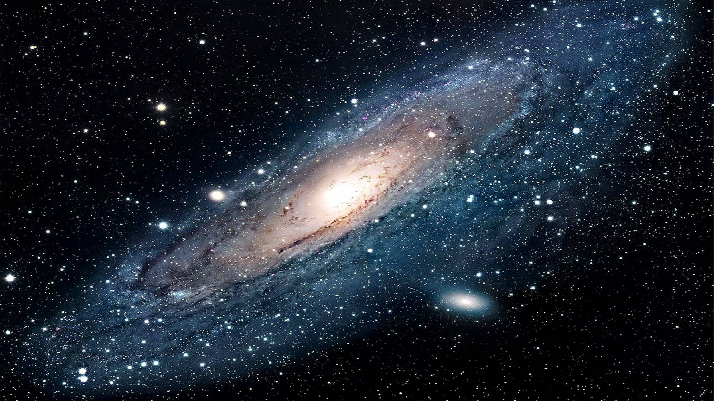
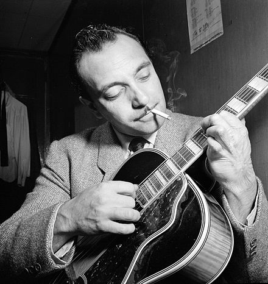

<!--
$theme: gaia
-->

### Call for speakers
# Dublin Django User Group
First week of December (day TBA)

1 Grand Canal Street Lower

_Jorge Barata_
@neuralhacker

---
<!--
$theme: gaia
$size: 16:9
template: invert
-->

# 

# ORIGIN

---

# Django Origin

## 

---
# Django Origin

## 

---

# Django Origin

## PHP

---

# Django's father is PHP

---

### Django's father is PHP

# 

---

# Django Origins

## 2003
- Web department of the Lawrence Journal-World met Python
- Multiple web apps
- “The CMS”

---

1. Write web app 1
2. Write web app 2
3. Realize app 1 shares much in common with app 2
4. Refactor the code so that app 1 shares code with app 2
5. Repeat steps 2-4 several times
6. Realize you’ve invented a framework

---

# Django Origins

## 2005
- Public release
- 0.9.1
- BSD license
- “Django Reinhardt”

---

## Django Reinhardt

# 

