# La PARADOJA

# de INTERNET

<div class="cover-subtitle">
Micro-<strong>descentralizada</strong><br>
Macro-<strong>centralizada</strong>
</div>

<div>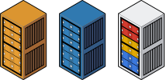</div>

<footer>
<span>Jorge Barata
<br>
<a href="https://jorgebg.com">jorgebg.com</a>
</span>
<br/>
<span>
T3chFest 2026
</span>
</footer>

Note:
Presentación: 20 minutos + 10 de preguntas.
Internet nació distribuida, pero hoy depende de unos pocos gigantes.
Bienvenidos a la paradoja.

---


---

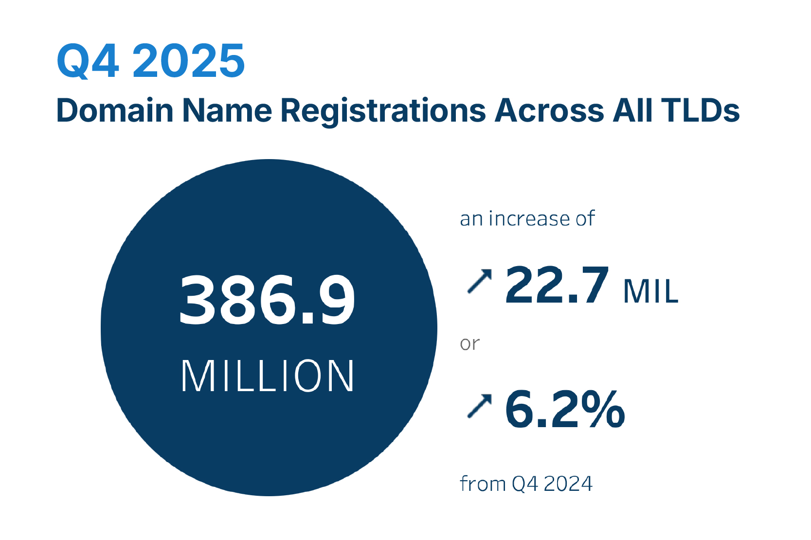

---

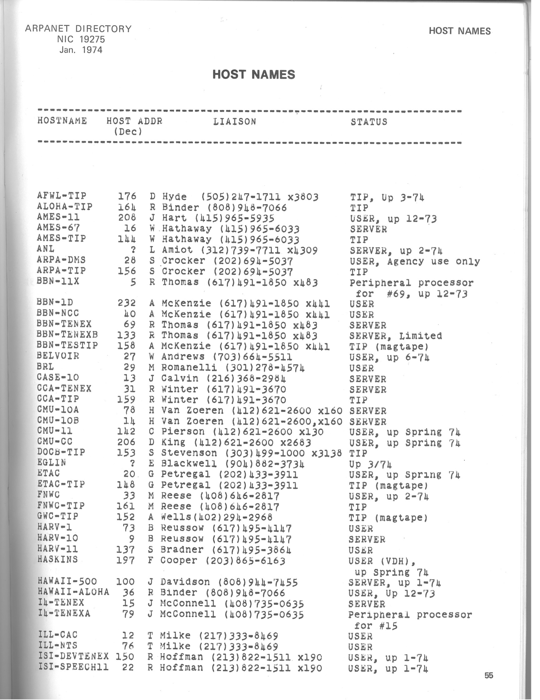

---

```
HOST : 26.5.0.64 : TCACCIS-FTSTEWART : VAX-11/750 : VMS : TCP/TELNET,TCP/FTP,TCP/SMTP :
HOST : 26.0.0.65 : AFSC-SD,AFSD : DEC-2020T : TOPS20 ::
HOST : 26.1.0.65 : AFSC-SD-TAC,SD-TIP : C/30 : TAC : TCP :
HOST : 26.2.0.65 : AEROSPACE,AERO : VAX-11/780 : UNIX : TCP/TELNET,TCP/FTP,TCP/SMTP :
HOST : 26.3.0.65 : MARTIN-ED,MMC-ED : PDP-11/45 : RSX11M : TCP/TELNET,TCP/FTP :
HOST : 26.4.0.65 : JPL-MILVAX : VAX-11/780 : VMS : TCP/TELNET,TCP/FTP,TCP/SMTP :
HOST : 26.5.0.65 : USC-ECL,ECL,USC-ECLA,ECLA : DEC-1090B : TOPS20 : TCP/TELNET,TCP/FTP,TCP/SMTP :
HOST : 26.6.0.65 : ACC : PDP-11/70 : UNIX : TCP/SMTP,TCP/TELNET,TCP/FTP :
HOST : 26.7.0.65 : USC-ECLB,ECLB : DEC-1090B : TOPS20 : TCP/TELNET,TCP/FTP,TCP/SMTP :
HOST : 26.1.0.66 : AFGL : PDP-11/50 : RSX11M : TCP/TELNET,TCP/FTP :
HOST : 26.2.0.66 : AFGL-TAC : C/30 : TAC : TCP :
HOST : 26.3.0.66 : MITRE-BEDFORD,MITRE-B,BEDFORD : VAX-11/780 : UNIX : TCP/TELNET,TCP/FTP,TCP/SMTP :
HOST : 26.0.0.67 : AFSC-HQ,HQAFSC : DEC-2040T : TOPS20 : TCP/TELNET,TCP/FTP,TCP/SMTP :
HOST : 26.1.0.67 : AFSC-HQ-TAC,HQAFSC-TAC : C/30 : TAC : TCP :
HOST : 26.2.0.67 : IGMIRS-CIDC : CTIWS-117 : CTOS : X.25 :
HOST : 26.3.0.67 : IGMIRS-DARCOM,DARCOM-IG,IGMIRS-DARCOM-IG : CTIWS-117 : CTOS : X.25 :
HOST : 26.0.0.69 : USGS2-MULTICS,DENVER : H-60/68 : MULTICS : TCP/TELNET,TCP/FTP,TCP/SMTP :
...
```

Note:
Elizabeth "Jake" Feinler
Llamando por teléfono
Actualizado de vez en cuando

---

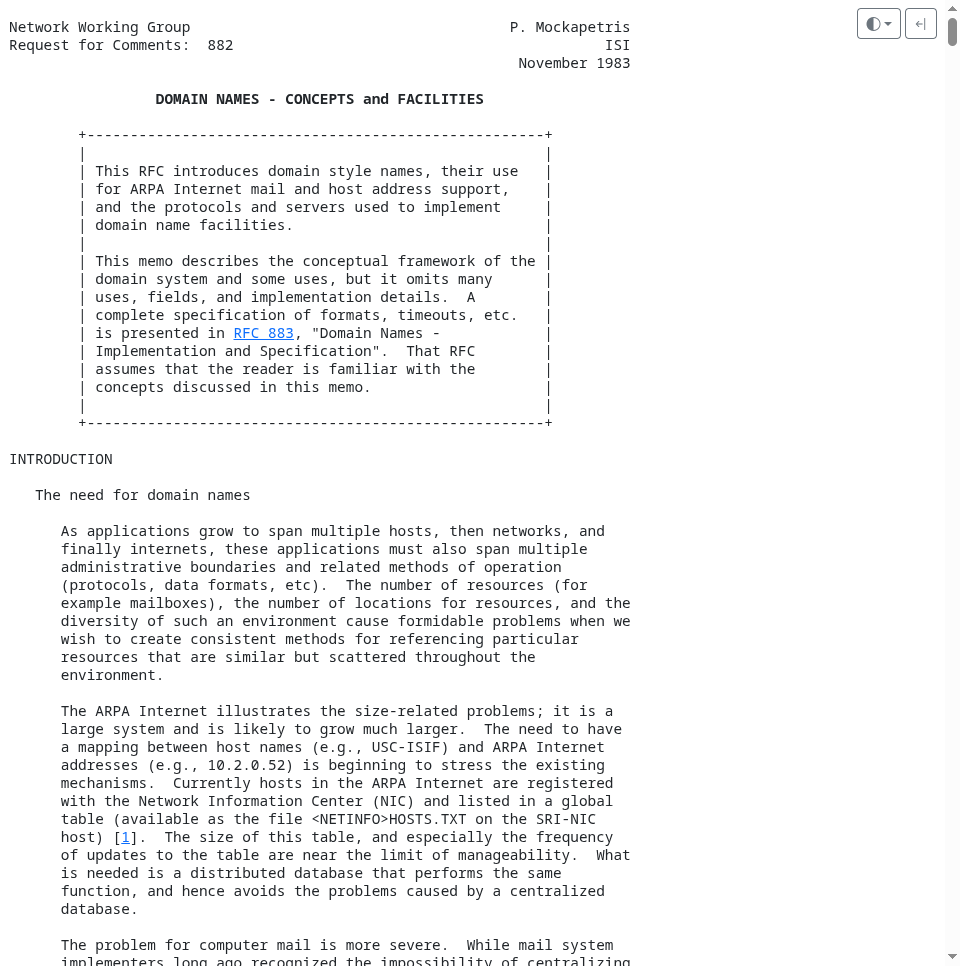

---

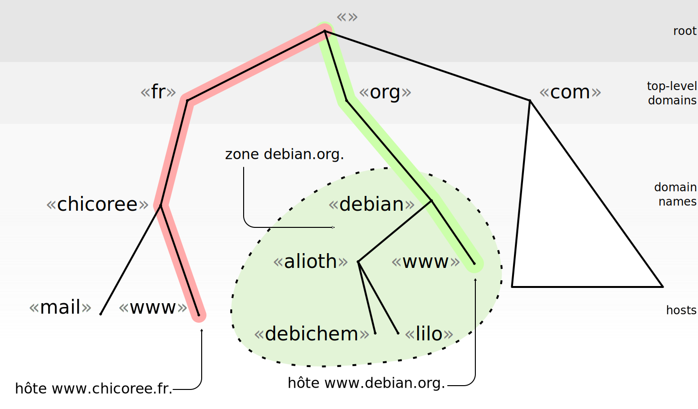

---

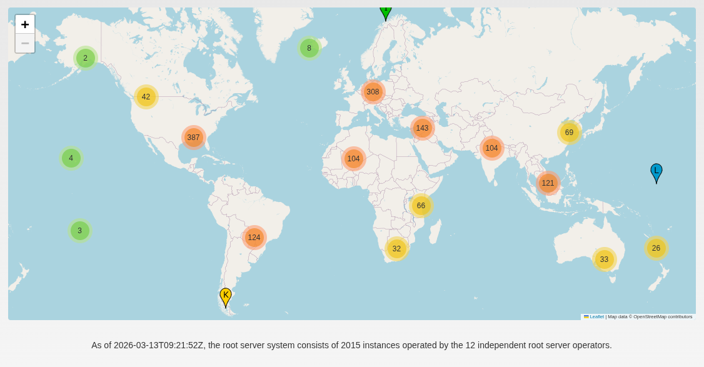

2015 root servers

**Descentralizado** <!-- .element: class="fragment" -->

---

## WWW

1991

Note:
Entornos universitarios y militares
Incluso antes de alcanzar la redundancia que tenemos hoy en día, en sus orígenes, normalmente, era un único servidor

---

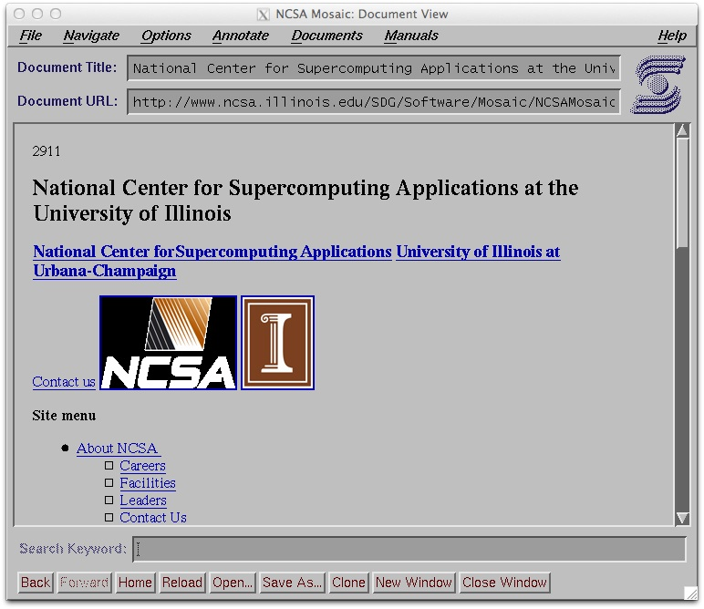

---

Round Robin

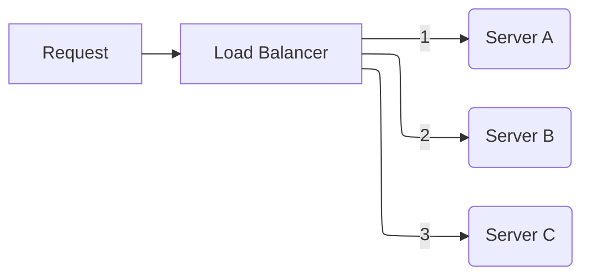
```mermaid
%%{init: {'flowchart': {'defaultRenderer': 'elk'}} }%%
graph LR
    A[Request] --> B[Load Balancer]
    B -->|1| S1(Server A)
    B -->|2| S2(Server B)
    B -->|3| S3(Server C)

```

---

```bash
$ dig +short debian.org
151.101.194.132
151.101.130.132
151.101.66.132
151.101.2.132
```

**Descentralizado** <!-- .element: class="fragment" -->

---

<div class="two-columns">
<div>
<h2>Amazon</h2>

1995

</div>

<div class="fragment">
<h2>Wikipedia</h2>

2001

</div>
</div>

Note:
Servidores web y servidor base de datos garaje
Servidor en oficina empresa

---

## Dot-com boom

1995-2000

On-Premise / Colocation <!-- .element: class="fragment" -->

VPS / Hosting compartido <!-- .element: class="fragment" -->

Nacimiento de las aplicaciones web <!-- .element: class="fragment" -->

**Descentralizado** <!-- .element: class="fragment" -->

Note:

Para empresas serias pre-nube (hasta ~2010): Tenías tu propio cuarto de servidores (On-Premise) o alquilabas armarios enteros de servidores físicos en un Data Center (Colocation). Tú comprabas los routers, los discos duros y pagabas la electricidad.

Carrera por la resiliencia

---

<div class="arch-diagram">
  <div class="arch-row">
    <span class="arch-icon ic-user"></span>
    <span class="arch-label">Usuario</span>
  </div>
  <div class="fragment">
    <div class="arch-arrow">↓</div>
    <div class="arch-row">
      <span class="arch-icon ic-cdn"></span>
      <span class="arch-label">CDN</span><span class="arch-sublabel">Global</span>
    </div>
  </div>
  <div class="fragment">
    <div class="arch-arrow">↓</div>
    <div class="arch-row">
      <span class="arch-icon ic-lb"></span>
      <span class="arch-label">Balanceadores</span>
    </div>
  </div>
  <div class="fragment">
    <div class="arch-arrow">↓</div>
    <div class="arch-row">
      <span class="arch-icon ic-servers"></span>
      <span class="arch-label">Servicios <span class="arch-loop">↺</span></span><span class="arch-sublabel">SOA/Microservicios</span>
    </div>
  </div>
  <div class="fragment">
    <div class="arch-arrow">↓</div>
    <div class="arch-row">
      <span class="arch-icon ic-db"></span>
      <span class="arch-label">Bases de datos</span><span class="arch-sublabel">Primary/Replica/Sharding</span>
    </div>
  </div>
</div>

---

<div style="display:flex;flex-direction:column;align-items:center;gap:0">
  <span class="arch-icon-sm ic-user"></span>
  <div class="arch-arrow-icon" style="color:#64748b;font-size:1em;line-height:1.4">↓</div>
  <div style="display:flex;gap:2em;align-items:flex-start">
    <div style="display:flex;flex-direction:column;align-items:center;color:#2563eb">
      <span class="arch-icon-sm ic-cdn"></span>
      <div class="arch-arrow-icon" style="font-size:0.9em;line-height:1.5">↓</div>
      <span class="arch-icon-sm ic-lb"></span>
      <div class="arch-arrow-icon" style="font-size:0.9em;line-height:1.5">↓</div>
      <span class="arch-icon-sm ic-servers"></span>
      <div class="arch-arrow-icon" style="font-size:0.9em;line-height:1.5">↓</div>
      <span class="arch-icon-sm ic-db"></span>
    </div>
    <div style="display:flex;flex-direction:column;align-items:center;color:#16a34a">
      <span class="arch-icon-sm ic-cdn"></span>
      <div class="arch-arrow-icon" style="font-size:0.9em;line-height:1.5">↓</div>
      <span class="arch-icon-sm ic-lb"></span>
      <div class="arch-arrow-icon" style="font-size:0.9em;line-height:1.5">↓</div>
      <span class="arch-icon-sm ic-servers"></span>
      <div class="arch-arrow-icon" style="font-size:0.9em;line-height:1.5">↓</div>
      <span class="arch-icon-sm ic-db"></span>
    </div>
    <div style="display:flex;flex-direction:column;align-items:center;color:#dc2626">
      <span class="arch-icon-sm ic-cdn"></span>
      <div class="arch-arrow-icon" style="font-size:0.9em;line-height:1.5">↓</div>
      <span class="arch-icon-sm ic-lb"></span>
      <div class="arch-arrow-icon" style="font-size:0.9em;line-height:1.5">↓</div>
      <span class="arch-icon-sm ic-servers"></span>
      <div class="arch-arrow-icon" style="font-size:0.9em;line-height:1.5">↓</div>
      <span class="arch-icon-sm ic-db"></span>
    </div>
    <div style="display:flex;flex-direction:column;align-items:center;color:#9333ea">
      <span class="arch-icon-sm ic-cdn"></span>
      <div class="arch-arrow-icon" style="font-size:0.9em;line-height:1.5">↓</div>
      <span class="arch-icon-sm ic-lb"></span>
      <div class="arch-arrow-icon" style="font-size:0.9em;line-height:1.5">↓</div>
      <span class="arch-icon-sm ic-servers"></span>
      <div class="arch-arrow-icon" style="font-size:0.9em;line-height:1.5">↓</div>
      <span class="arch-icon-sm ic-db"></span>
    </div>
  </div>
</div>

**Descentralizado** <!-- .element: class="fragment" -->

Note:
DB La mayor parte del tráfico lee, no escribe
También mejoraron rendimiento
Estoy simplificando mucho

Estas técnicas de descentralización por mejorar resiliencia ya se usaban antes

ARPANET fue diseñado para descentralizar las comunicaciones por si un nodo era destruido

Los mainframe antiguos repartían la carga

Mirrors en los 80, 90, 2000

---

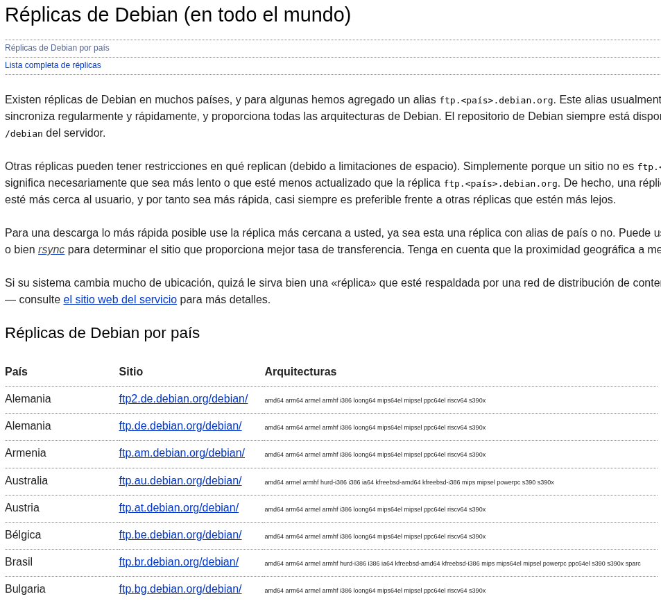

---

## Cloud providers

- AWS 2006
- GCP 2008
- Alibaba 2009
- Azure 2010

---

## CDN / Edge Cloud

- Akamai 1999
- Cloudflare 2010
- Fastly 2011

---

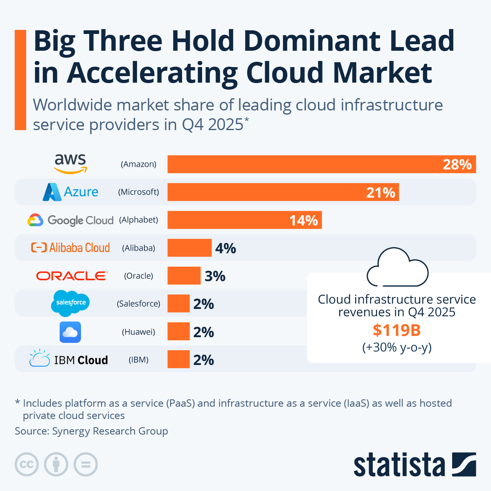

---

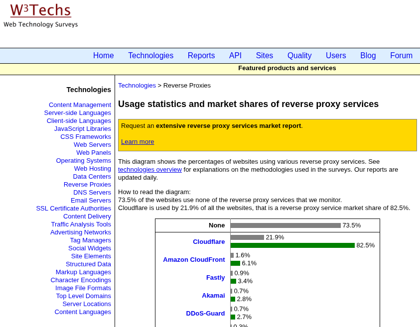

---

Más resiliente

Más eficiente

Más económico

<div class="fragment">
Más <strong>centralizado</strong>
</div>

---

<div style="display:flex;flex-direction:column;align-items:center;gap:0">
  <span class="arch-icon-sm ic-user"></span>
  <div class="arch-arrow-icon" style="font-size:0.9em;line-height:1.5">↓</div>
  <div style="display:flex;gap:2em;align-items:flex-start">
    <div style="display:flex;flex-direction:column;align-items:center;color:#2563eb">
      <span class="arch-icon-sm ic-cdn"></span>
      <div class="arch-arrow-icon" style="font-size:0.9em;line-height:1.5">↓</div>
      <span class="arch-icon-sm ic-lb"></span>
      <div class="arch-arrow-icon" style="font-size:0.9em;line-height:1.5">↓</div>
      <span class="arch-icon-sm ic-servers"></span>
      <div class="arch-arrow-icon" style="font-size:0.9em;line-height:1.5">↓</div>
      <span class="arch-icon-sm ic-db"></span>
    </div>
    <div style="display:flex;flex-direction:column;align-items:center;color:#16a34a">
      <span class="arch-icon-sm ic-cdn"></span>
      <div class="arch-arrow-icon" style="font-size:0.9em;line-height:1.5">↓</div>
      <span class="arch-icon-sm ic-lb"></span>
      <div class="arch-arrow-icon" style="font-size:0.9em;line-height:1.5">↓</div>
      <span class="arch-icon-sm ic-servers"></span>
      <div class="arch-arrow-icon" style="font-size:0.9em;line-height:1.5">↓</div>
      <span class="arch-icon-sm ic-db"></span>
    </div>
    <div style="display:flex;flex-direction:column;align-items:center;color:#dc2626">
      <span class="arch-icon-sm ic-cdn"></span>
      <div class="arch-arrow-icon" style="font-size:0.9em;line-height:1.5">↓</div>
      <span class="arch-icon-sm ic-lb"></span>
      <div class="arch-arrow-icon" style="font-size:0.9em;line-height:1.5">↓</div>
      <span class="arch-icon-sm ic-servers"></span>
      <div class="arch-arrow-icon" style="font-size:0.9em;line-height:1.5">↓</div>
      <span class="arch-icon-sm ic-db"></span>
    </div>
    <div style="display:flex;flex-direction:column;align-items:center;color:#9333ea">
      <span class="arch-icon-sm ic-cdn"></span>
      <div class="arch-arrow-icon" style="font-size:0.9em;line-height:1.5">↓</div>
      <span class="arch-icon-sm ic-lb"></span>
      <div class="arch-arrow-icon" style="font-size:0.9em;line-height:1.5">↓</div>
      <span class="arch-icon-sm ic-servers"></span>
      <div class="arch-arrow-icon" style="font-size:0.9em;line-height:1.5">↓</div>
      <span class="arch-icon-sm ic-db"></span>
    </div>
  </div>
</div>

---

<div style="display:flex;flex-direction:column;align-items:center;gap:0">
  <span class="arch-icon-sm ic-user"></span>
  <div class="arch-arrow-icon" style="font-size:0.9em;line-height:1.5">↓</div>
  <div style="display:flex;gap:2em;align-items:flex-start;color:#FF9900">
    <div style="display:flex;flex-direction:column;align-items:center">
      <span class="arch-icon-sm ic-cdn"></span>
      <div class="arch-arrow-icon" style="font-size:0.9em;line-height:1.5">↓</div>
      <span class="arch-icon-sm ic-lb"></span>
      <div class="arch-arrow-icon" style="font-size:0.9em;line-height:1.5">↓</div>
      <span class="arch-icon-sm ic-servers"></span>
      <div class="arch-arrow-icon" style="font-size:0.9em;line-height:1.5">↓</div>
      <span class="arch-icon-sm ic-db"></span>
    </div>
    <div style="display:flex;flex-direction:column;align-items:center">
      <span class="arch-icon-sm ic-cdn"></span>
      <div class="arch-arrow-icon" style="font-size:0.9em;line-height:1.5">↓</div>
      <span class="arch-icon-sm ic-lb"></span>
      <div class="arch-arrow-icon" style="font-size:0.9em;line-height:1.5">↓</div>
      <span class="arch-icon-sm ic-servers"></span>
      <div class="arch-arrow-icon" style="font-size:0.9em;line-height:1.5">↓</div>
      <span class="arch-icon-sm ic-db"></span>
    </div>
    <div style="display:flex;flex-direction:column;align-items:center">
      <span class="arch-icon-sm ic-cdn"></span>
      <div class="arch-arrow-icon" style="font-size:0.9em;line-height:1.5">↓</div>
      <span class="arch-icon-sm ic-lb"></span>
      <div class="arch-arrow-icon" style="font-size:0.9em;line-height:1.5">↓</div>
      <span class="arch-icon-sm ic-servers"></span>
      <div class="arch-arrow-icon" style="font-size:0.9em;line-height:1.5">↓</div>
      <span class="arch-icon-sm ic-db"></span>
    </div>
    <div style="display:flex;flex-direction:column;align-items:center">
      <span class="arch-icon-sm ic-cdn"></span>
      <div class="arch-arrow-icon" style="font-size:0.9em;line-height:1.5">↓</div>
      <span class="arch-icon-sm ic-lb"></span>
      <div class="arch-arrow-icon" style="font-size:0.9em;line-height:1.5">↓</div>
      <span class="arch-icon-sm ic-servers"></span>
      <div class="arch-arrow-icon" style="font-size:0.9em;line-height:1.5">↓</div>
      <span class="arch-icon-sm ic-db"></span>
    </div>
  </div>
</div>

---

```
~ $ dig +short api.trello.com
52.222.132.14
52.222.132.87
52.222.132.62
52.222.132.126
```

```
~ $ dig +short api.gotinder.com
api-cloudfront-failover.gotinder.com.
dzf1174d4gjln.cloudfront.net.
52.222.132.10
52.222.132.56
52.222.132.116
52.222.132.22
```

---

¿Qué pasa si hay falla?

---

## Octubre 2025

 <!-- .element: class="fragment" -->

---

## **AWS** Octubre 2025

<ul class="two-columns">
<li>Redsys, Bizum</li>
<li>Banca</li>
<li>Spotify, Twitch</li>
<li>Canva, Jira, Slack</li>
<li>Duolingo</li>
<li>Reddit, Snapchat</li>
<li>LoL, Fortnite</li>
<liSteam</li>
<li>Ticketmaster</li>
<li>Aena</li>
<li>...</li>
</ul>

Note:
Bug latente

---


---


---


---

## Post-mortem

---

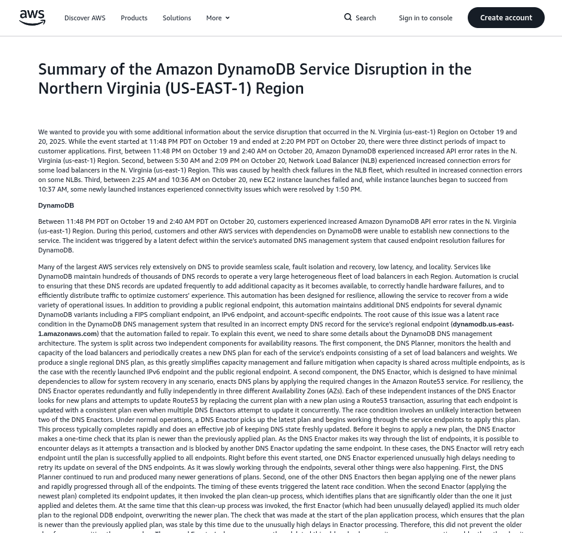

---


---

<div class="arch-diagram">
  <div class="arch-row">
    <span class="arch-icon ic-map-pin"></span>
    <span class="arch-label">US-EAST-1 Virginia</span>
  </div>
  <div class="arch-row">
      <span class="arch-icon ic-db"></span>
    <span class="arch-label">DynamoDB</span><span class="arch-sublabel">Aumenta la demanda</span>
  </div>
  <div class="arch-row">
    <span class="arch-icon ic-file-plus"></span>
    <span class="arch-label">DNS Planner lanza <em>Plan Nuevo</em></span>
  </div>
  <div class="arch-row">
    <span class="arch-icon ic-ghost"></span>
    <span class="arch-label"><em>Plan Viejo</em> (Zombi) despierta</span>
  </div>
  <div class="arch-row">
    <span class="arch-icon ic-alert-triangle"></span>
    <span class="arch-label">Borra las IPs del otro plan</span>
  </div>
  <div class="arch-row">
    <span class="arch-icon ic-circle-x"></span>
    <span class="arch-label">DNS devuelve cero IPs</span><span class="arch-sublabel"></span>
  </div>
  <div class="arch-row">
    <span class="arch-icon ic-db-x"></span>
    <span class="arch-label">DynamoDB inaccesible</span>
  </div>
</div>

---

## **Cloudflare** Noviembre 2025

- ChatGPT
- X (Twitter), Forocoches, Downdetector
- Canva, Zoom
- League of Legends
- Áreas de clientes de la banca

Note:
Actualización

---

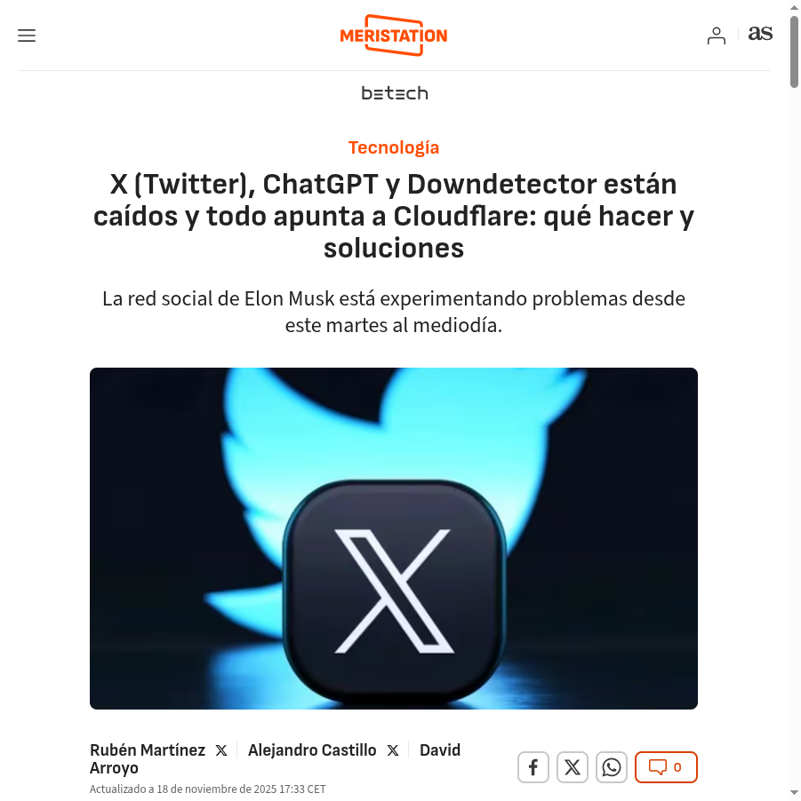

---

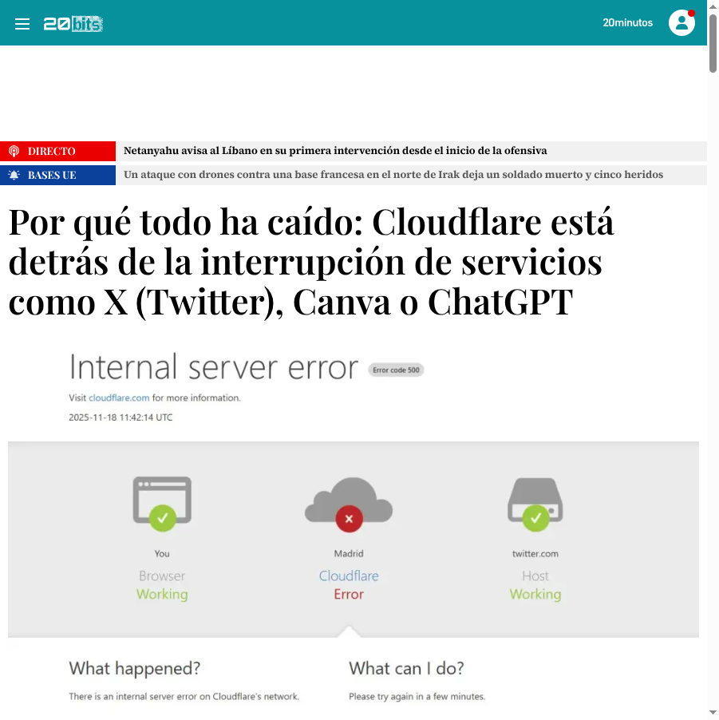

---


---

## **GCP** Junio 2025

<ul class="two-columns">
<li>Google Workspace</li>
<li>Spotify</li>
<li>Twitch, Discord</li>
<li>Snapchat</li>
<li>Rocket League</li>
<li>OpenAI</li>
<li>Cloudflare</li>
<li>Fitbit, Nest</li>
<li>Banca y Salud</li>
</ul>

Note:
Bug latente
Servicios como Workers KV y Zero Trust fallaron por depender de Google

---


---


---

## **Fastly** Junio 2021

<ul class="two-columns">
<li>Periódicos</li>
<li>Streaming</li>
<li>Amazon</li>
<li>PayPal, eBay</li>
<li>Reddit, Pinterest</li>
<li>GitHub</li>
<li>Stack Overflow</li>
<li>Gov.uk</li>
</ul>

---

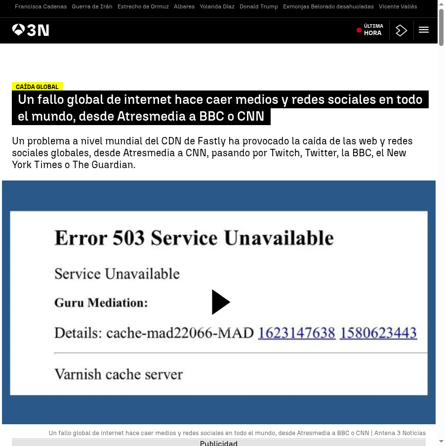

---

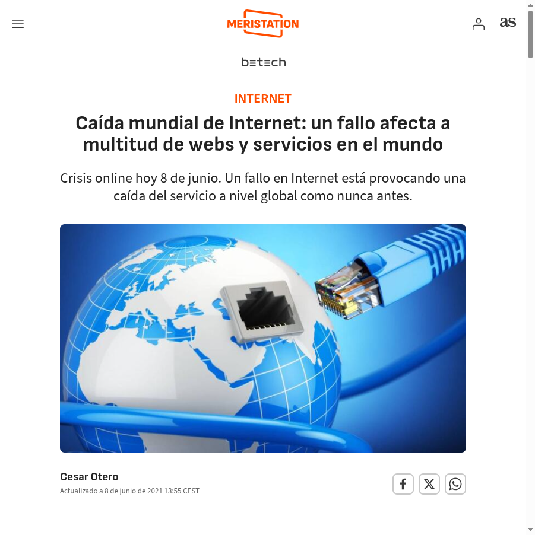

---

## Tiene muchas **ventajas**

- Alta Disponibilidad
- Costes
- Global
- Innovación
- Abstracción de Infraestructura

Si quieres estar en el mercado hoy, tienes que estar en la nube. <!-- .element: class="fragment" -->

Note:

Si quieres estar en el mercado hoy, tienes que estar en la nube.
Ataques phisings, scams. Agentes maliciosos.
Las vulnerabilidades afectan a todos. Charla de Jorge Rey

Pero si no quieres estar en el mercado, también te viene bien. Con todas estas ventajas, quién más creéis que lo usa?

---


---


---

[hayahora.futbol](https://hayahora.futbol)

---

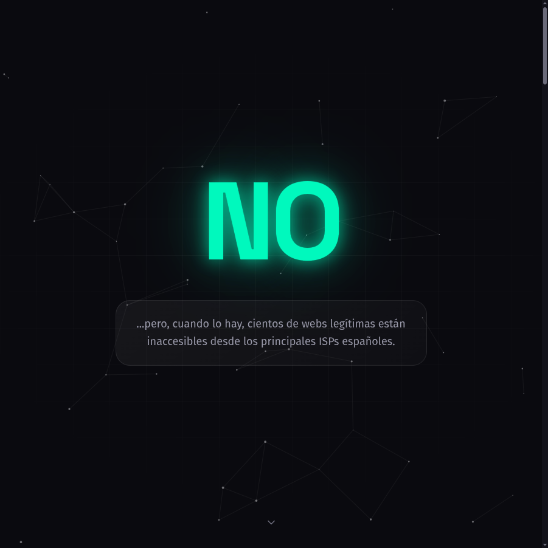

Note:
Lo mencionaba ayer ReD en charla soberanía digital, son cuatro frikis

---

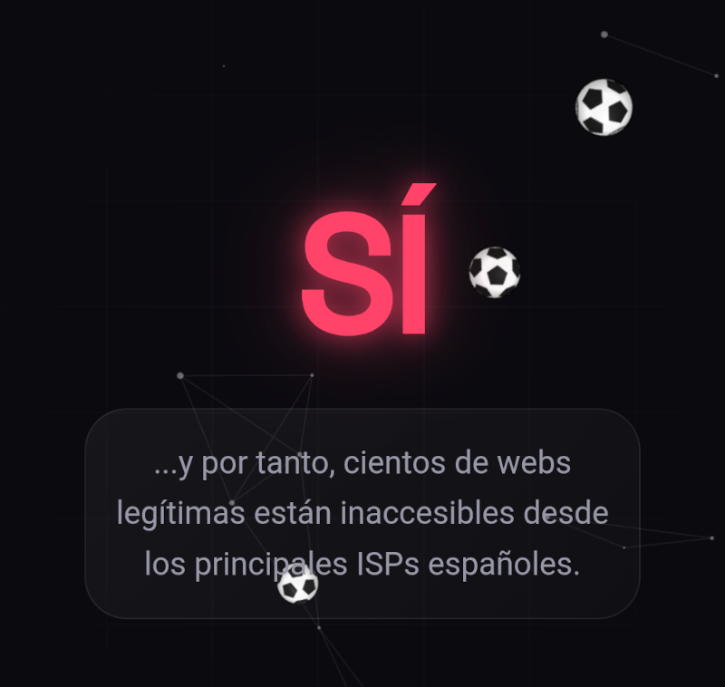

---

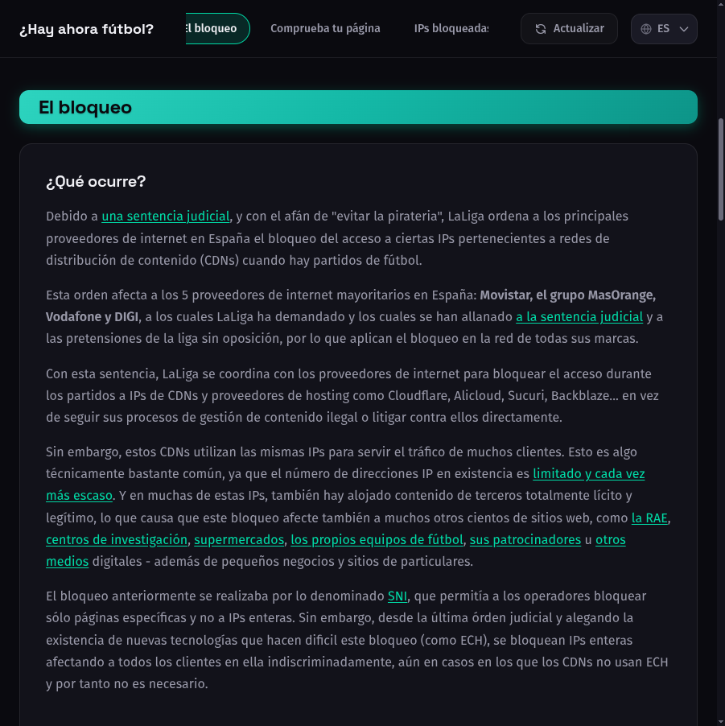

---

> Debido a una sentencia judicial, y con el afán de "evitar la pirateria", LaLiga ordena a los principales proveedores de internet en España el bloqueo del acceso a ciertas IPs pertenecientes a redes de distribución de contenido (CDNs) cuando hay partidos de fútbol.

[hayahora.futbol](https://hayahora.futbol)

---

## **¿Qué hacemos?**

---

## Plano técnico

_Graceful degradation_

_Multi-Cloud High Availability_

Note:
Técnicamente

---

## Plano político

Big 3: 60%-70% del mercado

**Oligopolio** <!-- .element: class="fragment" -->

Note:
Políticamente
Pocas empresas, mucho poder

---


---

Infraestructura **Local**

Note:
No es sano para internet que un problema eléctrico en Virginia (US-EAST-1) paralice el parking de nuestro aeropuerto. Compras comida de proximidad.

---

## **Soberanía** Digital

Note:
Obviando el negocio
Charla de ReD ayer

---

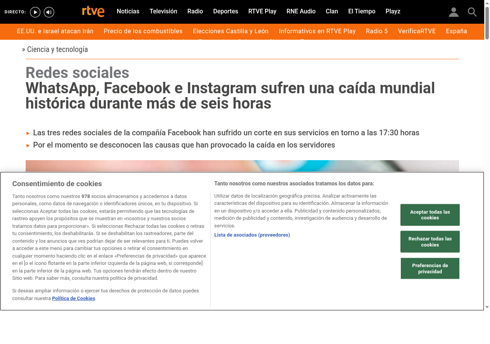

Note:

Meta no usa los Big three, pero cuando tuvieron un problema de configuración, cayó WhatsApp, Facebook e Instagram.

Ámbito de comunicaciones y social.

---

Trabajemos con **protocolos**, no con plataformas.

- ActivityPub (Mastodon)
- AT Protocol (Bluesky)

---

<div></div>

<small class="attributtion">
Imágenes de Wikimedia Commons y The Noun Project (CC BY 3.0)<br>
Iconos The Noun Project: "user person" by icelloid, "content delivery network" by Fath Yusuf Iskhaqy, "load balancer" by agnesID, "server stack" by Rizky Mardika, "database stack" by Firman Syah
</small>

<footer>
<span>Jorge Barata
<br>
<a href="https://jorgebg.com">jorgebg.com</a>
</span>
<br/>
<span>
T3chFest 2026
</span>
</footer>
