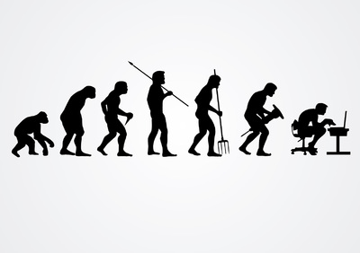
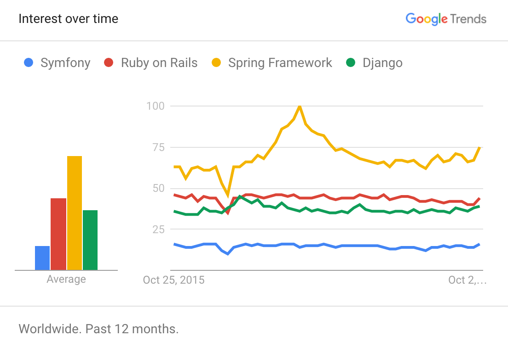
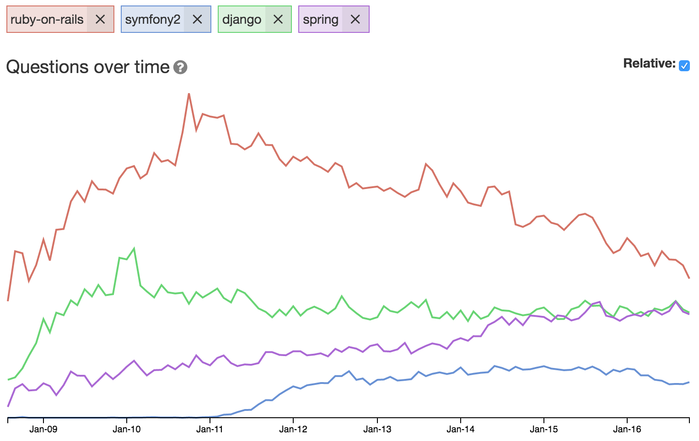
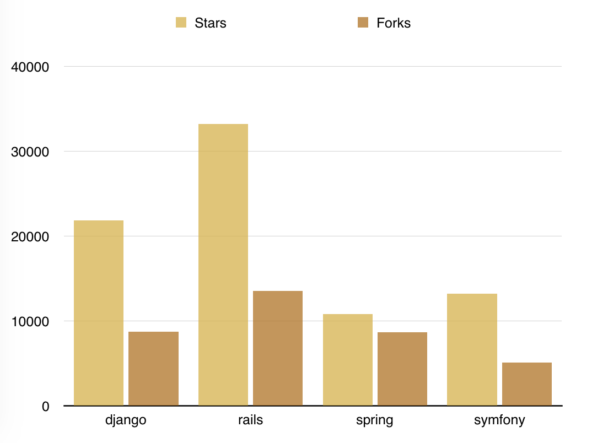
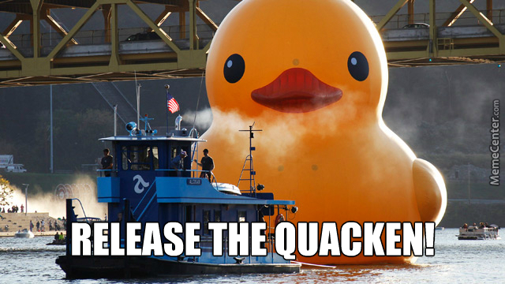
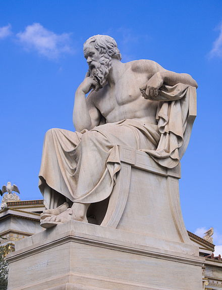

<!--
$theme: gaia
$size: 16:9
template: invert
-->

# Why

# 

##### Jorge Barata

---

# Origins

---
# Origins

## 

---
# Origins

## PHP

---

## 

---

# Origins

## 2003
- Web department of the Lawrence Journal-World met Python
- Multiple web apps
- “The CMS”

<!-- php -->

---

# Origins

## 2005
- Public release
- 0.9.1
- BSD license
- “Django Reinhardt”

<!-- it was efficiently powering most of World Online's sites -->

---

# Origins

## 2008
- Django Software Foundation
- 1.0

<!-- The Django Book -->

---

# Origins

## Key Matters

1. Django’s “sweet spot”:
    - Django was born in a news environment
    - features that are particularly well suited for “content” sites
2. Its origins have shaped the culture of its community
	- real-world code

<!-- real-world code, rather than being an academic exercise or commercial -->

---

> Django was invented to meet fast-moving newsroom deadlines, while satisfying the tough requirements of experienced Web developers

---

# Today

## Django is the most popular Python web framework

---

---

---

---

## Team

## 

---

## Team

- Core team
  - Group of trusted volunteers who manage the project

- Technical board
  - 5 comitters, elected after each feature release
  - Experienced and active committers who steer technical choices
  - Their main concern is to maintain the quality and stability

---

# Release process

## 

---

# Release process

- Feature release: **A.B alpha/beta/rc N**
  - **Nth** alpha/beta/release candidate of version **A.B**
  - Some of them LTS (3 years)
- Patch release: A.B.C
  - bugfix and security releases
  - backwards-compatible with the previous release
  - security > compatibility

---

# Design philosophies

## 

---

## Loose coupling
- Full stack but the pieces are independent of another wherever possible

## Less code
- No boilerplate

## Quick development

---

## Don't Repeat Yourself
- Redundancy is bad. Normalization is good.

## Explicit is better than implicit
- No “magic” unless there’s a really good reason for it

## Consistency
- Low-level (coding style)
- High-level (the “experience” of using Django)

---

# Why Web Framework?

---

> The point of a Web framework in the 21st century is to make the tedious aspects of Web development fast

---

1. Write a Web app from scratch.
2. Write another Web app from scratch.
3. Realize the app from step 1 shares much in common with the app from step 2
4. Refactor the code so that app 1 shares code with app 2
5. Repeat steps 2-4 several times
6. Realize you’ve invented a framework.

<!-- The Django Book -->

---

##  «Don't Repeat Yourself»
## Community
## Free software

<!-- a framework is not a black box -->

---

# __MVC__

## _Model_

## _View_

## _Controller_

---

# __MVC__

## _Model_

## _~~View~~_ _Template_

## _~~Controller~~_ _View_

---

## Model

# Active Record

> An object that wraps a row in a database table or view, encapsulates the database access, and adds domain logic on that data.

- Model instances
- Querysets
- Managers

---

## Model

- Backend Support
	- PostgreSQL
	- MySQL
	- SQLite

- Migrations
	- Can automatically create migrations comparing model versions

---

## _~~View~~_ _Template_

- Django Template Language (DTL)
- It is not a programming language
  - Designed for... designers. No Python knowledge required.
- Inheritance
- Variables, tags and filters.

---

## __~~Controller~~__ Views

- Function based views
- Class based views
	- CRUD

---

## Contrib

---

## Contrib

- The Django admin site
- django.contrib.auth
- The contenttypes framework
- The flatpages app
- GeoDjango
- django.contrib.humanize
- The messages framework

---

## Contrib

- django.contrib.postgres
- The redirects app
- The sitemap framework
- The “sites” framework
- The staticfiles app
- The syndication feed framework

---

# Modern web ecosystem

# 

---

# Modern web ecosystem

# 

---

## Modern web ecosystem

- Asynchronous tasks
  - Celery

- APIs
  - Django Rest Framework
    - _Viewsets_
    - _Serializers_

- Web sockets
  - Django Channels

---

# Python

---

# Python

- General-purpose language
- Scientific
- Numeric
- IT Automation

<!-- SRE ansible -->

---

# Thank you!

---

# Bibliography

- The Definitive Guide to Django (Adrian Holovaty & Jacob Kaplan-Moss, Apress)
- Two Scoops of Django (Greenfelds, Two Scoops Press)
- [www.python.org](http://www.python.org)
- [docs.djangoproject.com](http://docs.djangoproject.com)
- [www.martinfowler.com](http://www.martinfowler.com/eaaCatalog/activeRecord.html)
- Google Trends, Stack Overflow Trends, GitHub, LinkedIn
---

# Django Girls Workshop
## @ PyCon Ireland
## Mon November 7th 2016
- Free programming workshop for women
- Deadline is Sunday October 30, 23:00 (Dublin Time)
- Place are limited to 30 people